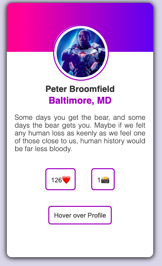
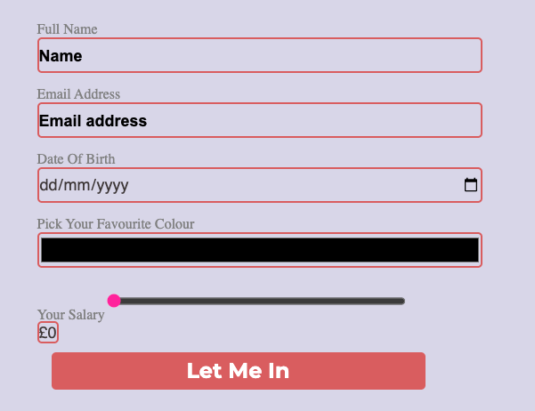

# Motorway UI Test

Welcome to the Motorway UI technical test. This test focuses on user experience, and your skills with HTML, CSS, a11y and leveraging browser APIs.
# Motorway UI Test 
Here is how the card looks like and you can hover over the picture to inlarge it.
## Overview
To run the project, the commands are:

*  npm install
*  npm run serve
*  npm run start

Test it on Chrome.

### 1. UI development

Here is how the card looks like you can hover the picture to inlarge it.

### 2. Performance
I did few changes in the App.js page to speed up the performance.

### 3. Forms
Here is how the form looks like.

